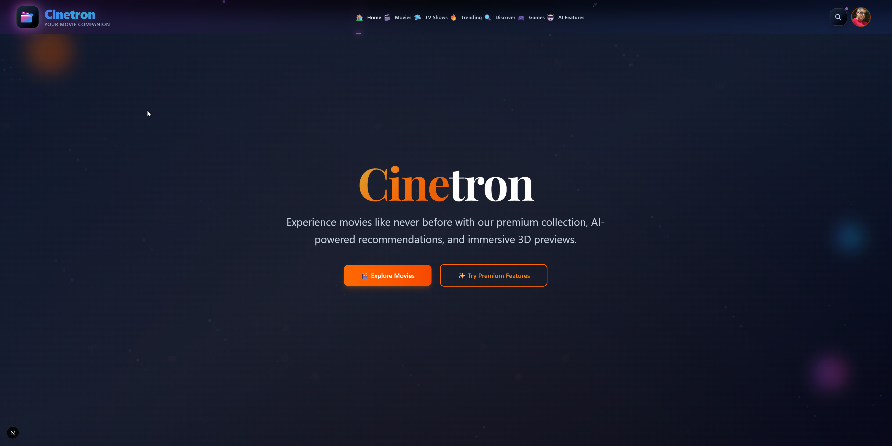
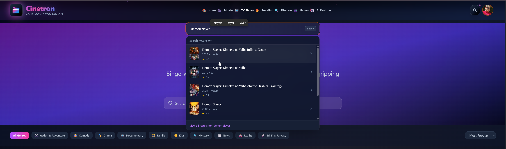

# 🎬 Cinetron Premium

A modern movie discovery platform built with Next.js 15, featuring trending movies, TV shows, and an elegant user interface with smooth animations.



## 🌟 What is Cinetron?

Cinetron is a premium movie discovery application that allows users to explore trending movies, popular TV shows, and search for their favorite content. Built with modern web technologies, it provides a smooth and engaging user experience with beautiful animations and responsive design.

## ✨ Features

- 🎥 **Trending Movies**: Discover the latest trending movies
- 📺 **Popular TV Shows**: Browse popular TV series
- 🔍 **Universal Search**: Search movies, TV shows, and people
- 🎨 **Premium UI**: Beautiful glassmorphism design with smooth animations
- 📱 **Responsive**: Works perfectly on desktop, tablet, and mobile
- ⚡ **Fast Performance**: Optimized with Next.js 15 and React Query
- 🌙 **Dark Theme**: Elegant dark mode interface

## 🛠️ Built With

- **Next.js 15** - React framework with App Router
- **TypeScript** - Type-safe JavaScript
- **Tailwind CSS** - Utility-first CSS framework
- **Framer Motion** - Smooth animations
- **React Query** - Data fetching and caching
- **Zustand** - State management
- **TMDB API** - Movie and TV show data

## 📋 Requirements

- Node.js 18 or higher
- npm or yarn
- TMDB API key ([Get one here](https://www.themoviedb.org/settings/api))

## 🚀 Getting Started

1. **Clone the repository**

   ```bash
   git clone https://github.com/Ameerusa86/movies_app_2025.git
   cd movies_app_2025
   ```

2. **Install dependencies**

   ```bash
   npm install
   ```

3. **Set up environment variables**

   Create a `.env.local` file in the root directory:

   ```env
   NEXT_PUBLIC_TMDB_API_KEY=your_tmdb_api_key_here
   NEXT_PUBLIC_TMDB_BASE_URL=https://api.themoviedb.org/3
   NEXT_PUBLIC_TMDB_IMAGE_BASE_URL=https://image.tmdb.org/t/p
   ```

4. **Run the development server**

   ```bash
   npm run dev
   ```

5. **Open your browser**

   Navigate to [http://localhost:3000](http://localhost:3000)

## 📸 Screenshots

### Homepage


### Movie Details


### TV Shows


### Search Feature



## 🚀 Deployment

The easiest way to deploy Cinetron is using [Vercel](https://vercel.com):

[](https://vercel.com/new/clone?repository-url=https://github.com/Ameerusa86/movies_app_2025)

Remember to add your environment variables in the Vercel dashboard.

## 📱 Features Demo

- **Responsive Design**: Works on all screen sizes
- **Smooth Animations**: 60fps animations with Framer Motion
- **3D Effects**: Interactive particle backgrounds
- **Smart Search**: Real-time search with instant results
- **Load More**: Infinite scroll pagination
- **Premium Cards**: Hover effects and glass morphism

## 🔗 API

This project uses [The Movie Database (TMDB)](https://www.themoviedb.org/) API to fetch movie and TV show data. You'll need to create a free account and get an API key to run the application.

## 📄 License

This project is licensed under the MIT License - see the [LICENSE](LICENSE) file for details.

## 👨‍💻 Developer

**Ameer Hasan**

- 🌐 **Portfolio**: [ameerdev.com](https://ameerdev.com)
- 💼 **LinkedIn**: [linkedin.com/in/ameerdev](https://www.linkedin.com/in/ameerdev/)
- 🐱 **GitHub**: [github.com/Ameerusa86](https://github.com/Ameerusa86)
- 📧 **Email**: ameer@example.com

## 🙏 Acknowledgments

- [The Movie Database (TMDB)](https://www.themoviedb.org/) for providing the movie data
- [Next.js](https://nextjs.org/) for the amazing React framework
- [Tailwind CSS](https://tailwindcss.com/) for the utility-first CSS framework
- [Framer Motion](https://framer.com/motion) for smooth animations

---

⭐ If you like this project, please give it a star on GitHub!

**Built with ❤️ by Ameer Hasan**
